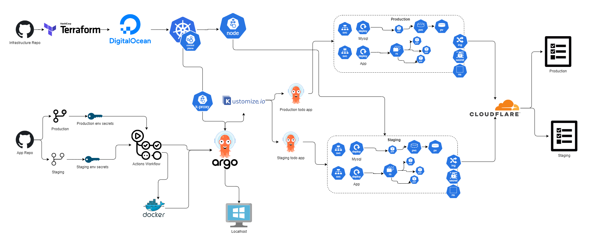
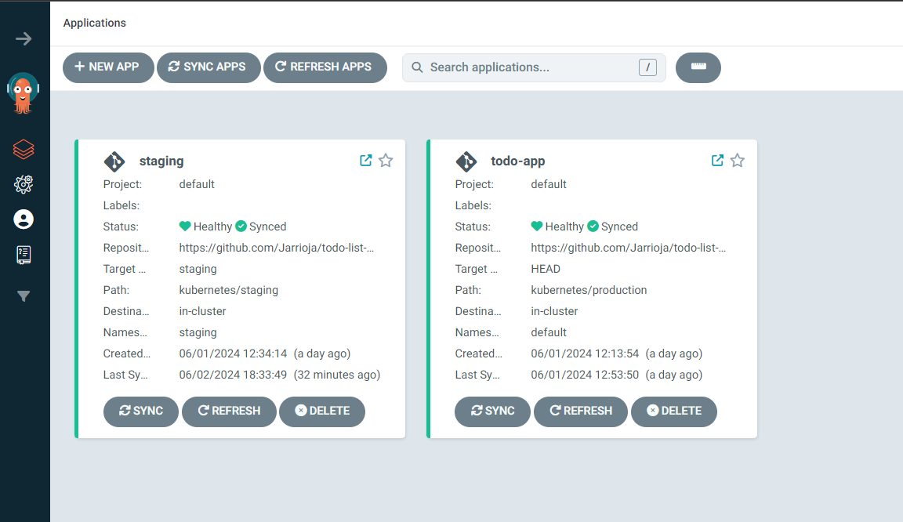
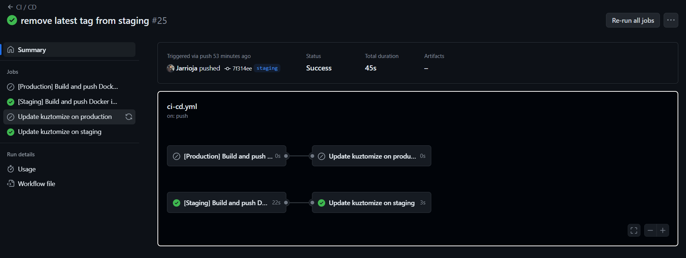
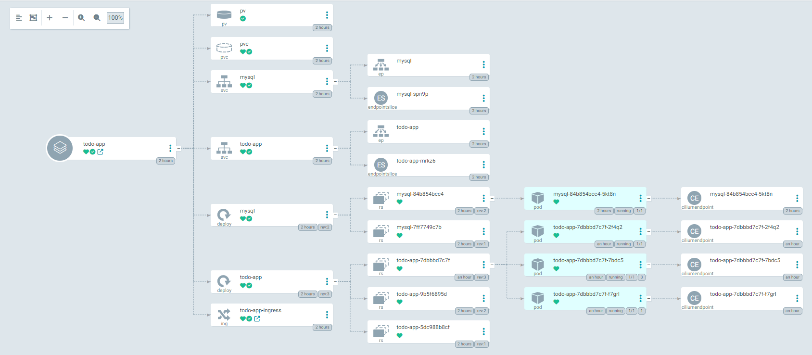
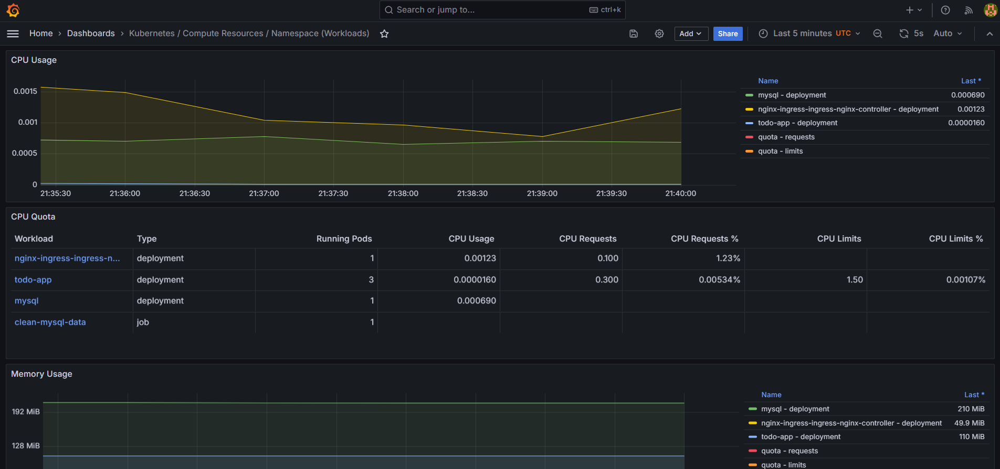

# Documentacion del Proyecto DEVOPS - Todo App
Este proyecto consiste en la implementación de un cluster de Kubernetes en DigitalOcean. La infraestructura se configura utilizando Terraform, y se incluyen scripts de inicialización para la configuración y la instalación de aplicaciones clave como Ingress, Prometheus, Grafana y ArgoCD en el Cluster. 

La aplicación desplegada es una aplicación de tareas (To-Do app) desarrollada en NodeJS, con un frontend en React y una API en Express, que requiere una base de datos MySQL, pueden encontrar el repo de esta aplicación en **https://github.com/Jarrioja/todo-list-devops**.

## Arquitectura del Proyecto
### Cluster de Kubernetes:
* **Nodo Único:** Para reducir costos, el cluster de Kubernetes se configura con un solo nodo.
* **DigitalOcean:** La infraestructura del cluster se despliega en DigitalOcean.
* **Terraform:** Utilizamos Terraform para definir y desplegar la infraestructura.

### Aplicación:
* **Frontend:** Desarrollado en React.
* **Backend:** API desarrollada en Express (NodeJS).
* **Base de Datos:** MySQL.
* **[todo-app.jesusarrioja.com](https://todo-app.jesusarrioja.com/)**
* **[staging-todo-app.jesusarrioja.com](https://staging-todo-app.jesusarrioja.com/)**

### CI/CD:
* **GitHub Actions:** Utilizado para CI/CD, con dos ambientes: producción y staging.
* **ArgoCD:** Se encarga de aplicar los cambios en los repositorios siguiendo el patrón Gitflow.

### Monitoreo:
* **Prometheus:** Se utiliza para monitorear la aplicación y la infraestructura.
* **Grafana:** Se utiliza para visualizar los datos de Prometheus.

### CDN:
* **Cloudflare:** Se utiliza para alojar el CDN.

### Configuración de la Infraestructura
1. **Terraform**: 
    * Se utiliza Terraform para definir la infraestructura del cluster de Kubernetes en DigitalOcean.
    * El archivo Terraform incluye un bloque local-exec para la configuración del usuario que administrará el Kubernetes.

2. **Scripts de Inicialización:**
    * Generación de secretos necesarios para la aplicación.
    * Instalación de Ingress y ArgoCD usando Helm charts.

## Pasos de Implementación
### 1. Despliegue del Cluster de Kubernetes:
* Crear el archivo Terraform con la configuración del cluster de Kubernetes.
* Ejecutar Terraform para desplegar el cluster en DigitalOcean.
* Utilizar local-exec en Terraform para configurar el usuario administrador de Kubernetes, generar secretos y instalar aplicaciones necesarias (Ingress, ArgoCD, Prometheus y Grafana) usando Helm charts.

### 2. Despliegue de la Aplicación:
* Configurar el **[repositorio de la aplicación](https://github.com/Jarrioja/todo-list-devops)** con los manifiestos de Kubernetes en un directorio kubernetes.
* Inicializar apps en ArogCD.
* Utilizar un archivo kustomization.yaml para configurar los ambientes y despliegues:
    * base/ para los manifiestos originales.
    * staging/ y production/ para los overlays específicos de cada ambiente.

### 3. Configuración de CI/CD: https://github.com/Jarrioja/todo-list-devops/actions
* Configurar **[GitHub Actions](https://github.com/Jarrioja/todo-list-devops/actions)** con dos jobs para cada push a las ramas main y staging:
    1. Build y Push de la imagen de Docker:
        * Se construye y sube la imagen de Docker.
    2. Actualización del kustomize.yaml:
        * Se actualiza la versión de la imagen en los manifiestos de Kubernetes.

### 4. Gestión de Variables de Entorno:
* Almacenar las variables de entorno en GitHub usando Repository y Environment secrets.
* Aplicar estas variables durante el build de la imagen Docker.

### 5. Aplicación de Cambios con ArgoCD:
* ArgoCD monitorea los cambios en el repositorio y aplica automáticamente las actualizaciones en el cluster de Kubernetes siguiendo el patrón Gitflow.

### 6. Configuracion de DNS:
* Configurar Cloudflare para mostrar la aplicación en los dominio correspondiente.

## Visualización de Ambientes - Como funciona
* **Producción:** https://todo-app.jesusarrioja.com/
* **Staging:** https://staging-todo-app.jesusarrioja.com/

## Puntos claves a destacar
* Uso de Terraform para gestionar la infraestructura, facilitando la replicación y modificación del entorno
* Uso de Helm para instalar aplicaciones en el cluster, simplificando la configuración y la actualización de las aplicaciones
* Utilización de GitHub Actions para automatizar la configuración y la actualización de la infraestructura y la aplicación
* Uso de secrets de GitHub para manejar variables de entorno, asegurando la seguridad y gestión centralizada.
* Uso de Kustomize para manejar configuraciones específicas por entorno.
* Uso de ArgoCD para gestionar los cambios en el repositorio y aplicar automáticamente las actualizaciones en el cluster
* Utilización de Prometheus y Grafana para monitorear el estado y el rendimiento de la aplicación y la infraestructura